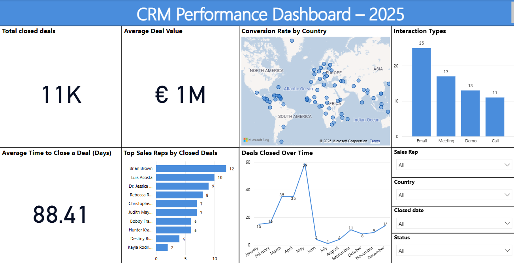

# 📊 CRM Performance Dashboard – 2025

This project showcases a professional CRM dashboard built in **Power BI**, powered by SQL data. It analyzes customer interactions, sales rep performance, and deal closures using data visualizations and KPIs.

---

## 🧩 Overview

The dashboard provides actionable insights into:

- 🔥 Total closed deals and average deal value  
- ⏱️ Average time to close a deal  
- 👤 Top-performing sales reps  
- 🌍 Conversion rates by country  
- 📬 Most effective interaction types before closing a deal  
- 📈 Monthly deal closure trends  
- 🎛️ Interactive slicers for rep, country, status, and date filtering  

---

## 📂 Project Files

- `crm_dashboard_final.pbix` – Main Power BI dashboard file  
- `preview.png` – Screenshot of the dashboard layout  
- `README.md` – This file  

---

## 🛠️ Tools Used

- **Power BI Desktop**  
- **SQL (MySQL Workbench)** for data queries  
- **DAX** for dynamic KPIs and metrics  
- **GitHub** for versioning and portfolio hosting  

---

## 📸 Dashboard Preview

---

## 👨‍💼 Author

**Shoaib Shaikh**  
Business Analytics Student | Aspiring Data Analyst

[LinkedIn](https://linkedin.com) | [GitHub](https://github.com)

---

## 📌 Note

This dashboard is part of a professional portfolio project. It can be adapted to real CRM systems with live databases (Salesforce, HubSpot, Zoho, etc.) for stakeholder reporting or marketing insights.

